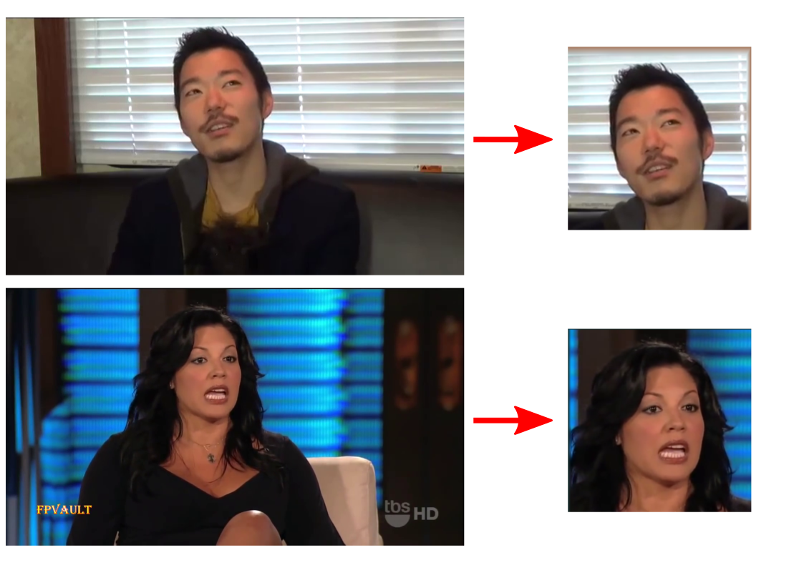

# Download and Preprocessing scripts for VoxCeleb datasets

This is an auxiliary repo for downloading VoxCeleb videos and preprocessing of the extracted frames by cropping them around the face. For detecting and cropping the face area we use the landmark estimation method proposed in [1], [face-alignment](https://github.com/1adrianb/face-alignment).

<p align="center">

</p>

## Installation


* Python 3.5+ 
* Linux
* Pytorch (>=1.5)

### Instal requirments:
```
pip install -r requirements.txt
```

### Install  youtube-dl:
```
pip install --upgrade youtube_dl
```

### Install ffmpeg
```
sudo apt-get install ffmpeg
```

### Download auxilliary models and save them under `./pretrained_models`

| Path | Description
| :--- | :----------
|[FaceDetector](https://drive.google.com/file/d/1IWqJUTAZCelAZrUzfU38zK_ZM25fK32S/view?usp=sharing)  | SFD face detector for [face-alignment](https://github.com/1adrianb/face-alignment).

## Overview

* Download videos of VoxCeleb1 or VoxCeleb2 dataset from youtube
* Split videos in smaller ones using the metadata provided by the datasets and delete original videos
* Extract frames from each video with REF_FPS = 25
* Crop frames using the face boxes from the metadata and facial landmarks
* Files are saved as:
```
.path/to/voxdataset
|-- id10271                           # identity index
|   |-- 37nktPRUJ58                   # video index
|   |   |-- chunk_videos              # chunk_videos: original video splitted in smaller ones
|   |   |   |-- 37nktPRUJ58#00001#257-396.mp4 
|   |   |   |-- ...
|   |   |-- frames                    # extracted frames
|   |   |   |-- 00_000025.png
|   |   |   |-- ...
|   |   |-- frames_cropped            # preprocessed frames
|   |   |    |-- 00_000025.png
|   |   |    |-- ...
|   |-- Zjc7Xy7aT8c
|   |   | ...
|-- id10273
|   | ...
```

## Download VoxCeleb datasets

1. Download metadata from [VoxCeleb1](https://www.robots.ox.ac.uk/~vgg/data/voxceleb/vox1.html) and [VoxCeleb2](https://www.robots.ox.ac.uk/~vgg/data/voxceleb/vox2.html)

```
wget www.robots.ox.ac.uk/~vgg/data/voxceleb/data/vox1_test_txt.zip
unzip vox1_test_txt.zip
mv ./txt ./vox1_txt_test

wget www.robots.ox.ac.uk/~vgg/data/voxceleb/data/vox1_dev_txt.zip
unzip vox1_dev_txt.zip
mv ./txt ./vox1_txt_train

```

```
wget www.robots.ox.ac.uk/~vgg/data/voxceleb/data/vox2_test_txt.zip
unzip vox2_test_txt.zip
mv ./txt ./vox2_txt_test

wget www.robots.ox.ac.uk/~vgg/data/voxceleb/data/vox2_dev_txt.zip
unzip vox2_dev_txt.zip
mv ./txt ./vox2_txt_train

```

2. Run this script to download videos from youtube. Note that the original videos will be removed. Optionally extract and preprocess frames.

```
python download_voxCeleb.py --dataset vox1 --output_path ./VoxCeleb1_test --metadata_path ./vox1_txt_test --delete_mp4
```

## Preprocessing of video frames


1. If videos have already been downloaded, run this script to extract and preprocess frames.

```
python preprocess_voxCeleb.py --dataset vox1 --root_path ./VoxCeleb1_test --metadata_path ./vox1_txt_test
```
## Acknowledgments

This code borrows from [video-preprocessing](https://github.com/AliaksandrSiarohin/video-preprocessing) and [face-alignment](https://github.com/1adrianb/face-alignment).

## References

[1] Bulat, Adrian, and Georgios Tzimiropoulos. "How far are we from solving the 2D & 3D face alignment problem?(and a dataset of 230,000 3d facial landmarks)." Proceedings of the IEEE International Conference on Computer Vision. 2017.


